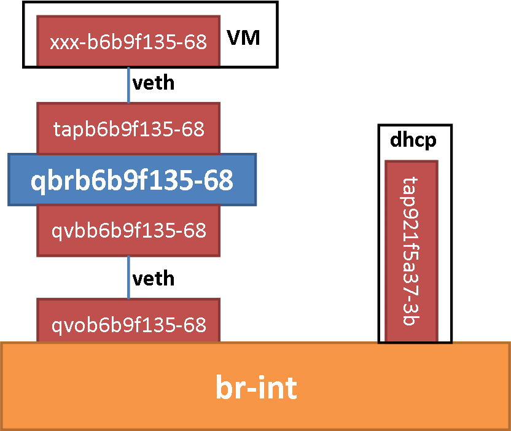

# Neutron dhcp agent 详细解析

**环境：**

1. devstack all in one。
2. network:
 1. name : `private`
 2. type : `vxlan`
 3. subnet : 
  1. private-subnet `10.0.0.0/24`
  2. ipv6-private-subnet `fd28:f82d:79fd::/64`

**dhcp agent 的作用：**

neutron dhcp为租户网络提供DHCP服务，即IP地址动态分配，另外还会提供metadata请求服务。

**架构图：**



## dhcp agent 的工作原理

1. dhcp agent 依靠运行 dnsmasq 程序来监听 dhcp 请求，为网络提供 dhcp 服务。
2. dhcp agent 会为每个 network 创建一个 namespace（例如：`qdhcp-fc066cb7-ade6-43bc-8221-fd9139d918b8`）
3. dhcp agent 会在该 namespace 中创建一个网卡（例如：`tap921f5a37-3b`），该网卡上会有 network 中所有提供 dhcp 服务的 subnet 的一个 ip 地址（`10.0.0.2/24`）
4. 这个网卡的类型可以是 Linux 上的 veth 类型的网卡，也可以使用 ovs 来创建网卡，这个由一个配置选项决定（`ovs_use_veth`）。
5. dhcp agent 会将创建的网卡连接到网桥 br-int 上
6. neutron-server 收到创建 port 的请求（vm 创建时）后会创建网卡的各种属性（mac地址、ip地址等），然后通过 RPC 通知 dhcp agnet 该网卡的信息，dhcp agent 会将这些配置信息写入到数据文件中（*/opt/stack/data/neutron/dhcp/fc066cb7-ade6-43bc-8221-fd9139d918b8* 目录下），然后重新加载 dnsmasq 程序。
7. vm 启动时，会发送 dhcp 请求，该请求会通过 br-int bridge 到达运行 dhcp 监听的网卡 `tap921f5a37-3b`。这时，dnsmasq 会通过检索自身的配置文件发现与该网卡对应的 ip 地址，然后将这个 ip 地址返回给 vm，完成 dhcp 的相应。

* 为 vm 创建 port，到 vm 启动获取 ip 地址的数据流如下图：


## dhcp agent 的启动

* 在 devstack 的环境中，我们可以看到启动 dhcp agent 的命令如下：

```
/usr/bin/neutron-dhcp-agent --config-file /etc/neutron/neutron.conf --config-file /etc/neutron/dhcp_agent.ini & echo $! >/opt/stack/status/stack/q-dhcp.pid; fg || echo "q-dhcp failed to start" | tee "/opt/stack/status/stack/q-dhcp.failure"
```

* 这个 neutron-dhcp-agent 是如何来的呢？我们看 neutron 的 setup.cfg 文件：

```
[entry_points]
...
    neutron-dhcp-agent = neutron.cmd.eventlet.agents.dhcp:main
```

* 根据上面的信息，我们在 _neutron/cmd/eventlet/agents/dhcp.py_ 中看到：

```
from neutron.agent import dhcp_agent


def main():                                                                                                                                                            
    dhcp_agent.main()
```

_neutron/agent/dhcp\_agent.py_

```
def main():
    register_options(cfg.CONF)
    common_config.init(sys.argv[1:])
    config.setup_logging()
    server = neutron_service.Service.create(
        binary='neutron-dhcp-agent',
        topic=topics.DHCP_AGENT,
        report_interval=cfg.CONF.AGENT.report_interval,
        manager='neutron.agent.dhcp.agent.DhcpAgentWithStateReport')
    service.launch(cfg.CONF, server).wait()
```

1. 调用 `register_options` 注册 dhcp agent 的相关配置选项
2. 调用 `common_config.init(sys.argv[1:])` 从配置文件中读取配置（这里说明：配置文件中的选项会覆盖默认选项）
3. 调用 `config.setup_logging` 设置 log 
4. 调用 `neutron_service.Service.create` 创建服务（最主要的项就是实例化 `neutron.agent.dhcp.agent.DhcpAgentWithStateReport` 为 `manager`）
5. 调用 `service.launch` 启动服务

关于 `neutron_service.Service` 这里就不多分析了。

## dhcp agent 的初始化

在上面的 `main` 方法中，完成了 dhcp agent 的启动。那么它做了什么事情？

1. 在初始化 server 的同时，初始化了 `manager`
2. `service.launch` 启动服务，其实是调用了 `neutron_service.Service` 的 `start` 方法，在这个里面做了三个事情：
 1. 调用 manager 的 `init_host` 方法
 2. 将 manger 作为 endpoint，topic 为 `topics.DHCP_AGENT` 来启动一个 RPC Server。
 3. 调用 manager 的 `after_start` 方法

### manager 的初始化

根据继承关系，manager 的初始化涉及到两个方法，分别是：`DhcpAgent.__init__` 和 `DhcpAgentWithStateReport.__init__`。

#### `DhcpAgent.__init__` 方法

1. 初始化一个 `NetworkCache` 的实例 `cache`，用于保存当前 dhcp agent 所维护的网络的相关信息；
2. 根据配置信息导入 `Dnsmasq` 类作为 dhcp agent 的 `dhcp_driver_cls`；
3. 通过实例化 `DhcpPluginApi` 为 `plugin_rpc` 来启动 RPC Client 端和 neutron-server 通信；
4. 调用 `_populate_networks_cache` 处理 dhcp agent 之前维护的 network 资源（将其加入到缓存中）；
5. 建立一个 `ProcessMonitor` 的实例 `_process_monitor` 用来监测与 dhcp agent 有关的外部进程；

#### `DhcpAgentWithStateReport.__init__`

1. 创建一个 `PluginReportStateAPI` 实例 `state_rpc` 用来 RPC Clinet 来向 neutron-server 汇报 dhcp agent 的状态
2. 创建一个 `FixedIntervalLoopingCall` 的实例来定时执行 `_report_state` 方法（该方法会向 neutron server 来汇报 dhcp agent 的状态）。
3. `_report_state` 在第一次运行时会调用 `run` 方法来激活 dhcp agent。

##### `DhcpAgent.run`

通过调用该方法会孵化两个绿色线程，分别执行 `_periodic_resync_helper` 和 `_dhcp_ready_ports_loop`，这个两个方法都是死循环执行的方法。

1. `_periodic_resync_helper` 方法，该方法用该判断是否有需要进行同步的操作（增加、删除）网络资源。这种同步操作通过调用 `sync_state` 方法来实现。
2. `_dhcp_ready_ports_loop` 方法，该方法会调用 RPC Server 端的 `dhcp_ready_on_ports` 方法来告诉 neutron-server 那些 port 已经在 dhcp agent 端处理好。

### manager 的 `init_host`

该方法的作用为：当 dhcp agent 启动完成后，会对所有该 dhcp agent 所负责的 network 进行一遍配置（`safe_configure_dhcp_for_network`）工作。
可以理解为，当 dhcp agent 完成启动后，初始化其负责的网络资源。

### manager 的 `after_start`

记录一个 log

## dhcp agent 的 RPC 

dhcp agent 初始化完成后，主要靠 RPC 来与 Neutron-Server 进行通信。
dhcp agent 中有三套 RPC，分别是：

1. dhcp agent 用于向 neutron-server 汇报自身状态的 RPC
 * RPC Clinet：`PluginReportStateAPI`
 * RPC Server endpoint：`PluginReportStateAPI` 
2. neutron-server 用来向 dhcp agent 发送 network、subnet、port 创建、修改、删除信息的 RPC
 * RPC Clinet：`DhcpAgentNotifyApi`
 * RPC Server endpoint：`DhcpAgentWithStateReport`
3. dhcp agent 用于向 neutron-server 发送请求获取 network 详细信息、请求创建 dhcp agent port、发送网卡准备完成信息的 RPC
 * RPC Client：`DhcpPluginApi`
 * RPC Server endpoint：`DhcpRpcCallback` 

## dhcp agent 的 driver

接收到 RPC 的消息，就需要处理 RPC 消息。处理 PRC 消息，就是将 RPC 消息转化为底层的实现，也就是对 dnsmasq 和网络设备的操作。这部分我们称为 dhcp agent driver。

* dhcp agent 的 driver 分为两个部分：
 1. 负责管理 dnsmasq 进程的 `Dnsmasq`
 2. 负责管理网络设备（dhcp agent port）的 `DeviceManager`。网络设备的管理主要是调用 ip、ovs 的相关命令实现的（封装在 `interface.py` 模块中）。