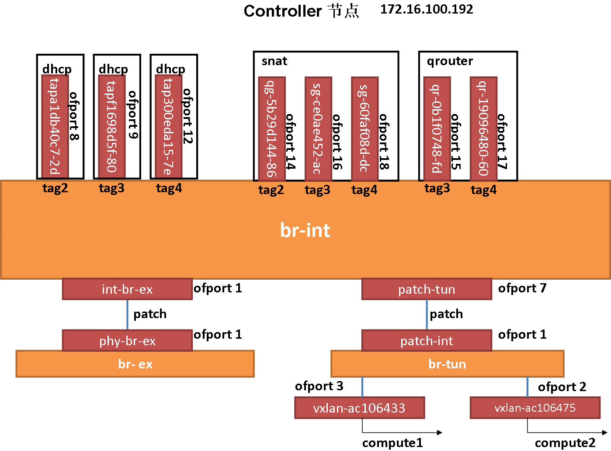

# Neutron 开启 Dvr 模式后流量的走向

ARP 请求的处理请见文章 *开启L2_pop后ARP请求的处理*，这里只说明获取 ARP 响应后的数据包是如何被处理的

## 系统结构图如下

* 网络节点结构图



* 计算节点一结构图


* 计算节点二结构图


## 数据包的流通过程

* 实验环境：

*我们从 vm1（计算节点一）来 ping vm2（计算节点二）。（我们不讲 ARP 请求与相应的过程，我们只讲数据包是如何从 vm1 传递到 vm2 的。）*

* vm1:
 * ip : 192.168.100.5, 172.16.100.250
 * mac : fa:16:3e:5c:9e:2d

* vm2
 * ip : 192.168.200.8, 172.16.100.243
 * mac : fa:16:3e:71:5a:c6

### vm1 发出数据包

* vm1 通过 ARP 请求获取 vm2 的地址后，开始构造发送到 vm2 的数据包，发送到 vm2 的数据包会首先转发到 vm1 所在的网关：

```
Dest IP: 192.168.200.8
Souce IP: 192.168.10.5
Dest MAC: MAC of 192.168.100.1
Source MAC: MAC of 192.168.100.5
```

我们看 br-int table 0 的规则：

```
[root@node2 ~]# ovs-ofctl dump-flows br-int table=0
NXST_FLOW reply (xid=0x4):
 cookie=0xb637cdfd05911130, duration=266429.068s, table=0, n_packets=0, n_bytes=0, idle_age=65534, hard_age=65534, priority=10,icmp6,in_port=3,icmp_type=136 actions=resubmit(,24)
 cookie=0xb637cdfd05911130, duration=266429.064s, table=0, n_packets=0, n_bytes=0, idle_age=65534, hard_age=65534, priority=10,arp,in_port=3 actions=resubmit(,24)
 cookie=0xb637cdfd05911130, duration=266437.459s, table=0, n_packets=0, n_bytes=0, idle_age=65534, hard_age=65534, priority=2,in_port=1 actions=drop
 cookie=0xb637cdfd05911130, duration=266429.074s, table=0, n_packets=0, n_bytes=0, idle_age=65534, hard_age=65534, priority=9,in_port=3 actions=resubmit(,25)
 cookie=0xb637cdfd05911130, duration=266437.421s, table=0, n_packets=0, n_bytes=0, idle_age=65534, hard_age=65534, priority=4,in_port=1,dl_src=fa:16:3f:24:77:e3 actions=resubmit(,2)
 cookie=0xb637cdfd05911130, duration=266437.416s, table=0, n_packets=0, n_bytes=0, idle_age=65534, hard_age=65534, priority=2,in_port=7,dl_src=fa:16:3f:24:77:e3 actions=resubmit(,1)
 cookie=0xb637cdfd05911130, duration=266437.411s, table=0, n_packets=0, n_bytes=0, idle_age=65534, hard_age=65534, priority=4,in_port=1,dl_src=fa:16:3f:cb:84:46 actions=resubmit(,2)
 cookie=0xb637cdfd05911130, duration=266437.404s, table=0, n_packets=0, n_bytes=0, idle_age=65534, hard_age=65534, priority=2,in_port=7,dl_src=fa:16:3f:cb:84:46 actions=resubmit(,1)
 cookie=0xb637cdfd05911130, duration=266433.654s, table=0, n_packets=946, n_bytes=90471, idle_age=65534, hard_age=65534, priority=3,in_port=1,vlan_tci=0x0000/0x1fff actions=mod_vlan_vid:3,NORMAL
 cookie=0xb637cdfd05911130, duration=266437.461s, table=0, n_packets=21, n_bytes=882, idle_age=65534, hard_age=65534, priority=1 actions=NORMAL
```

* 该数据包会被转发到 table 25 做进一步的处理，br-int table 25 的规则如下：

```
[root@node2 ~]# ovs-ofctl dump-flows br-int table=25
NXST_FLOW reply (xid=0x4):
 cookie=0xb637cdfd05911130, duration=266546.570s, table=25, n_packets=0, n_bytes=0, idle_age=65534, hard_age=65534, priority=2,in_port=3,dl_src=fa:16:3e:5c:9e:2d actions=NORMAL
```

* 数据包经过 table 25 的处理后会被正常转发，这时会有 *qr-0b1f0748-fd*（vm1 所在网络的网关接口）。

### 网关 *qr-0b1f0748-fd* 接收到数据包后进行转发

* *qr-0b1f0748-fd* 所在 namespace 转发规则为：

```
[root@node2 ~]# ip netns exec qrouter-1276cc22-fce6-4b07-a86d-1a26e1b7f056 sysctl net.ipv4.ip_forward
net.ipv4.ip_forward = 1
```

*允许进行 ip 转发的操作*

* *qr-0b1f0748-fd* 所在 namespace 转发规则为：arp table 为：

```
[root@node2 ~]# ip netns exec qrouter-1276cc22-fce6-4b07-a86d-1a26e1b7f056 ip nei
192.168.100.6 dev qr-0b1f0748-fd lladdr fa:16:3e:68:f3:5c PERMANENT
192.168.100.5 dev qr-0b1f0748-fd lladdr fa:16:3e:5c:9e:2d PERMANENT
192.168.200.3 dev qr-19096480-60 lladdr fa:16:3e:b4:a4:c8 PERMANENT
192.168.200.2 dev qr-19096480-60 lladdr fa:16:3e:d9:fc:fb PERMANENT
192.168.100.2 dev qr-0b1f0748-fd lladdr fa:16:3e:51:3b:f7 PERMANENT
192.168.200.8 dev qr-19096480-60 lladdr fa:16:3e:71:5a:c6 PERMANENT
```

*这表明要想到达 192.168.200.8 需要 qr-19096480-60（vm2 所在网络的网关）进行转发*

### 从 *qr-19096480-60* 发出的数据包：

```
Dest IP: 192.168.200.8
Souce IP: 192.168.10.5
Dest MAC: MAC of 192.168.200.8（fa:16:3e:71:5a:c6）
Source MAC: MAC of 192.168.200.1
```

从 *qr-19096480-60* 发出的数据包可以被 br-ex 和 br-tun 接收，我们看一下 br-ex 的处理规则：

* br-ex 的 flow entity

```
[root@node2 ~]# ovs-ofctl dump-flows br-ex
NXST_FLOW reply (xid=0x4):
 cookie=0xa02e63c944a0b07b, duration=267705.139s, table=0, n_packets=21, n_bytes=882, idle_age=65534, hard_age=65534, priority=4,in_port=1,dl_vlan=3 actions=strip_vlan,NORMAL
 cookie=0xa02e63c944a0b07b, duration=267708.932s, table=0, n_packets=0, n_bytes=0, idle_age=65534, hard_age=65534, priority=2,in_port=1 actions=resubmit(,1)
 cookie=0xa02e63c944a0b07b, duration=267752.696s, table=0, n_packets=0, n_bytes=0, idle_age=65534, hard_age=65534, priority=0 actions=NORMAL
 cookie=0xa02e63c944a0b07b, duration=267708.930s, table=0, n_packets=946, n_bytes=90471, idle_age=65534, hard_age=65534, priority=1 actions=resubmit(,3)
 cookie=0xa02e63c944a0b07b, duration=267708.928s, table=1, n_packets=0, n_bytes=0, idle_age=65534, hard_age=65534, priority=0 actions=resubmit(,2)
 cookie=0xa02e63c944a0b07b, duration=267708.926s, table=2, n_packets=0, n_bytes=0, idle_age=65534, hard_age=65534, priority=2,in_port=1 actions=drop
 cookie=0xa02e63c944a0b07b, duration=267708.901s, table=3, n_packets=0, n_bytes=0, idle_age=65534, hard_age=65534, priority=2,dl_src=fa:16:3f:24:77:e3 actions=output:1
 cookie=0xa02e63c944a0b07b, duration=267708.889s, table=3, n_packets=0, n_bytes=0, idle_age=65534, hard_age=65534, priority=2,dl_src=fa:16:3f:cb:84:46 actions=output:1
 cookie=0xa02e63c944a0b07b, duration=267708.924s, table=3, n_packets=946, n_bytes=90471, idle_age=65534, hard_age=65534, priority=1 actions=NORMAL
```

该数据包在 br-ex 中的流通顺序为：table0 --> table1 --> table2 --> drop


### 数据包在 br-tun 内的处理

* br-tun 的 table 0 规则：

```
[root@node2 ~]# ovs-ofctl dump-flows br-tun table=0
NXST_FLOW reply (xid=0x4):
 cookie=0x8ca031df7a84a666, duration=267881.083s, table=0, n_packets=967, n_bytes=91353, idle_age=65534, hard_age=65534, priority=1,in_port=1 actions=resubmit(,1)
 cookie=0x8ca031df7a84a666, duration=267876.107s, table=0, n_packets=0, n_bytes=0, idle_age=65534, hard_age=65534, priority=1,in_port=2 actions=resubmit(,4)
 cookie=0x8ca031df7a84a666, duration=267876.100s, table=0, n_packets=0, n_bytes=0, idle_age=65534, hard_age=65534, priority=1,in_port=3 actions=resubmit(,4)
 cookie=0x8ca031df7a84a666, duration=267881.121s, table=0, n_packets=0, n_bytes=0, idle_age=65534, hard_age=65534, priority=0 actions=drop
```

*数据包会被转发到 table 1 中继续处理*

* br-tun 的 table 1 规则：

```
[root@node2 ~]# ovs-ofctl dump-flows br-tun table=1
NXST_FLOW reply (xid=0x4):
 cookie=0x8ca031df7a84a666, duration=267947.154s, table=1, n_packets=0, n_bytes=0, idle_age=65534, hard_age=65534, priority=3,arp,dl_vlan=1,arp_tpa=192.168.100.1 actions=drop
 cookie=0x8ca031df7a84a666, duration=267947.063s, table=1, n_packets=0, n_bytes=0, idle_age=65534, hard_age=65534, priority=3,arp,dl_vlan=2,arp_tpa=192.168.200.1 actions=drop
 cookie=0x8ca031df7a84a666, duration=267947.151s, table=1, n_packets=0, n_bytes=0, idle_age=65534, hard_age=65534, priority=2,dl_vlan=1,dl_dst=fa:16:3e:e0:e5:95 actions=drop
 cookie=0x8ca031df7a84a666, duration=267947.061s, table=1, n_packets=0, n_bytes=0, idle_age=65534, hard_age=65534, priority=2,dl_vlan=2,dl_dst=fa:16:3e:dd:73:40 actions=drop
 cookie=0x8ca031df7a84a666, duration=267947.147s, table=1, n_packets=0, n_bytes=0, idle_age=65534, hard_age=65534, priority=1,dl_vlan=1,dl_src=fa:16:3e:e0:e5:95 actions=mod_dl_src:fa:16:3f:4d:40:29,resubmit(,2)
 cookie=0x8ca031df7a84a666, duration=267947.059s, table=1, n_packets=0, n_bytes=0, idle_age=65534, hard_age=65534, priority=1,dl_vlan=2,dl_src=fa:16:3e:dd:73:40 actions=mod_dl_src:fa:16:3f:4d:40:29,resubmit(,2)
 cookie=0x8ca031df7a84a666, duration=267955.148s, table=1, n_packets=967, n_bytes=91353, idle_age=65534, hard_age=65534, priority=0 actions=resubmit(,2)
```

*该数据包的 tag 为 2，dl_src 为 fa:16:3e:dd:73:40（192.168.200.1 的 mac 地址）， dl_src 会被修改为 fa:16:3f:4d:40:29 然后转发到 table 2 中继续处理*

这时候的数据包为：

```
Dest IP: 192.168.200.8
Souce IP: 192.168.10.5
Dest MAC: MAC of 192.168.200.8（fa:16:3e:71:5a:c6）
Source MAC: fa:16:3f:4d:40:29
```

* br-tun table 2 的规则：

```
[root@node2 ~]# ovs-ofctl dump-flows br-tun table=2
NXST_FLOW reply (xid=0x4):
 cookie=0x8ca031df7a84a666, duration=268190.195s, table=2, n_packets=32, n_bytes=1542, idle_age=65534, hard_age=65534, priority=1,arp,dl_dst=ff:ff:ff:ff:ff:ff actions=resubmit(,21)
 cookie=0x8ca031df7a84a666, duration=268190.192s, table=2, n_packets=661, n_bytes=69781, idle_age=65534, hard_age=65534, priority=0,dl_dst=00:00:00:00:00:00/01:00:00:00:00:00 actions=resubmit(,20)
 cookie=0x8ca031df7a84a666, duration=268190.190s, table=2, n_packets=274, n_bytes=20030, idle_age=65534, hard_age=65534, priority=0,dl_dst=01:00:00:00:00:00/01:00:00:00:00:00 actions=resubmit(,22)
```

*对于单播请求会被转发到 table 20 中继续处理*

* br-tun table 20 的规则

```
[root@node2 ~]# ovs-ofctl dump-flows br-tun table=20
NXST_FLOW reply (xid=0x4):
 cookie=0x8ca031df7a84a666, duration=268258.143s, table=20, n_packets=0, n_bytes=0, idle_age=65534, hard_age=65534, priority=2,dl_vlan=1,dl_dst=fa:16:3e:51:3b:f7 actions=strip_vlan,load:0x5d->NXM_NX_TUN_ID[],output:3
 cookie=0x8ca031df7a84a666, duration=268258.134s, table=20, n_packets=0, n_bytes=0, idle_age=65534, hard_age=65534, priority=2,dl_vlan=1,dl_dst=fa:16:3e:68:f3:5c actions=strip_vlan,load:0x5d->NXM_NX_TUN_ID[],output:3
 cookie=0x8ca031df7a84a666, duration=268257.541s, table=20, n_packets=0, n_bytes=0, idle_age=65534, hard_age=65534, priority=2,dl_vlan=2,dl_dst=fa:16:3e:d9:fc:fb actions=strip_vlan,load:0x34->NXM_NX_TUN_ID[],output:3
 cookie=0x8ca031df7a84a666, duration=268257.534s, table=20, n_packets=0, n_bytes=0, idle_age=65534, hard_age=65534, priority=2,dl_vlan=2,dl_dst=fa:16:3e:b4:a4:c8 actions=strip_vlan,load:0x34->NXM_NX_TUN_ID[],output:3
 cookie=0x8ca031df7a84a666, duration=174930s, table=20, n_packets=0, n_bytes=0, idle_age=65534, hard_age=65534, priority=2,dl_vlan=2,dl_dst=fa:16:3e:71:5a:c6 actions=strip_vlan,load:0x34->NXM_NX_TUN_ID[],output:2
 cookie=0x8ca031df7a84a666, duration=268267.766s, table=20, n_packets=661, n_bytes=69781, idle_age=65534, hard_age=65534, priority=0 actions=resubmit(,22)
```

*数据包的 tag 为 2，,dl_dst 为 fa:16:3e:71:5a:c6（192.168.200.8 的 mac 地址），会被从 2 号口（vxlan-ac106475）发出，也就是直接发送到 compute2*

*vxlan-ac106475* 是 vxlan 的 vtep 接口，会将源数据包用 vxlan 的形式封装（vni id 为 0x34），封装后的结果如下：

[vxlan 封装及转发图例](http://7xo6kd.com1.z0.glb.clouddn.com/upload-ueditor-image-20161106-1478392784308097415.png)

该消息经物理机的转发后会被 compute2 上的网桥 br-tun 中的 vxlan-ac106433 port 接收。

### 数据包在 compute2 br-tun 中的处理过程

* compute2 br-tun table 0 规则：

```
[root@node3 ~]# ovs-ofctl dump-flows br-tun table=0
NXST_FLOW reply (xid=0x4):
 cookie=0x838897a42fd54311, duration=175482.175s, table=0, n_packets=0, n_bytes=0, idle_age=65534, hard_age=65534, priority=1,in_port=1 actions=resubmit(,1)
 cookie=0x838897a42fd54311, duration=175476.377s, table=0, n_packets=0, n_bytes=0, idle_age=65534, hard_age=65534, priority=1,in_port=2 actions=resubmit(,4)
 cookie=0x838897a42fd54311, duration=175476.337s, table=0, n_packets=0, n_bytes=0, idle_age=65534, hard_age=65534, priority=1,in_port=3 actions=resubmit(,4)
 cookie=0x838897a42fd54311, duration=175482.222s, table=0, n_packets=0, n_bytes=0, idle_age=65534, hard_age=65534, priority=0 actions=drop
```

*数据包会被转发到 table 4 中处理*


* compute2 br-tun table 4 规则：

```
[root@node3 ~]# ovs-ofctl dump-flows br-tun table=4
NXST_FLOW reply (xid=0x4):
 cookie=0x838897a42fd54311, duration=175529.797s, table=4, n_packets=0, n_bytes=0, idle_age=65534, hard_age=65534, priority=1,tun_id=0x5d actions=mod_vlan_vid:2,resubmit(,9)
 cookie=0x838897a42fd54311, duration=175529.447s, table=4, n_packets=0, n_bytes=0, idle_age=65534, hard_age=65534, priority=1,tun_id=0x34 actions=mod_vlan_vid:1,resubmit(,9)
 cookie=0x838897a42fd54311, duration=175533.835s, table=4, n_packets=0, n_bytes=0, idle_age=65534, hard_age=65534, priority=0 actions=drop
```
 
vxlan-ac106433 接收到 vxlan 信息后会解封装，还原原始的数据包信息，所以数据包解封装后仍然为：

```
Dest IP: 192.168.200.8
Souce IP: 192.168.10.5
Dest MAC: MAC of 192.168.200.8（fa:16:3e:71:5a:c6）
Source MAC: MAC of fa:16:3f:4d:40:29
```

*tun_id（vni id）为 0x34 的数据包在被修改 tag 为 1 后发送到 table 9 中继续处理*


* compute2 br-tun table 9 的规则为：

```
[root@node3 ~]# ovs-ofctl dump-flows br-tun table=9
NXST_FLOW reply (xid=0x4):
 cookie=0x838897a42fd54311, duration=175900.606s, table=9, n_packets=0, n_bytes=0, idle_age=65534, hard_age=65534, priority=1,dl_src=fa:16:3f:4d:40:29 actions=output:1
 cookie=0x838897a42fd54311, duration=175900.595s, table=9, n_packets=0, n_bytes=0, idle_age=65534, hard_age=65534, priority=1,dl_src=fa:16:3f:cb:84:46 actions=output:1
 cookie=0x838897a42fd54311, duration=175900.645s, table=9, n_packets=0, n_bytes=0, idle_age=65534, hard_age=65534, priority=0 actions=resubmit(,10)
```

*dl_src 为 fa:16:3f:4d:40:29 的数据包从 1 口输出，进入到 br-int 中*


### 数据包在 br-int 中的处理过程

* compute2 br-int table 0 的规则：

```
[root@node3 ~]# ovs-ofctl dump-flows br-int table=0
NXST_FLOW reply (xid=0x4):
 cookie=0xb87aa5ae120b1aaf, duration=176664.678s, table=0, n_packets=0, n_bytes=0, idle_age=65534, hard_age=65534, priority=10,icmp6,in_port=3,icmp_type=136 actions=resubmit(,24)
 cookie=0xb87aa5ae120b1aaf, duration=176664.671s, table=0, n_packets=0, n_bytes=0, idle_age=65534, hard_age=65534, priority=10,arp,in_port=3 actions=resubmit(,24)
 cookie=0xb87aa5ae120b1aaf, duration=176673.114s, table=0, n_packets=0, n_bytes=0, idle_age=65534, hard_age=65534, priority=2,in_port=1 actions=drop
 cookie=0xb87aa5ae120b1aaf, duration=176664.687s, table=0, n_packets=0, n_bytes=0, idle_age=65534, hard_age=65534, priority=9,in_port=3 actions=resubmit(,25)
 cookie=0xb87aa5ae120b1aaf, duration=176673.078s, table=0, n_packets=0, n_bytes=0, idle_age=65534, hard_age=65534, priority=4,in_port=1,dl_src=fa:16:3f:4d:40:29 actions=resubmit(,2)
 cookie=0xb87aa5ae120b1aaf, duration=176673.073s, table=0, n_packets=0, n_bytes=0, idle_age=65534, hard_age=65534, priority=2,in_port=8,dl_src=fa:16:3f:4d:40:29 actions=resubmit(,1)
 cookie=0xb87aa5ae120b1aaf, duration=176673.068s, table=0, n_packets=0, n_bytes=0, idle_age=65534, hard_age=65534, priority=4,in_port=1,dl_src=fa:16:3f:cb:84:46 actions=resubmit(,2)
 cookie=0xb87aa5ae120b1aaf, duration=176673.063s, table=0, n_packets=0, n_bytes=0, idle_age=65534, hard_age=65534, priority=2,in_port=8,dl_src=fa:16:3f:cb:84:46 actions=resubmit(,1)
 cookie=0xb87aa5ae120b1aaf, duration=176668.757s, table=0, n_packets=0, n_bytes=0, idle_age=65534, hard_age=65534, priority=3,in_port=1,vlan_tci=0x0000/0x1fff actions=mod_vlan_vid:3,NORMAL
 cookie=0xb87aa5ae120b1aaf, duration=176673.116s, table=0, n_packets=0, n_bytes=0, idle_age=65534, hard_age=65534, priority=1 actions=NORMAL
```

该数据包在 br-int 中会被正常转发，然后被 *qvo865e336b-28* 接收送到 vm2。

这就是整个数据包的流通过程。